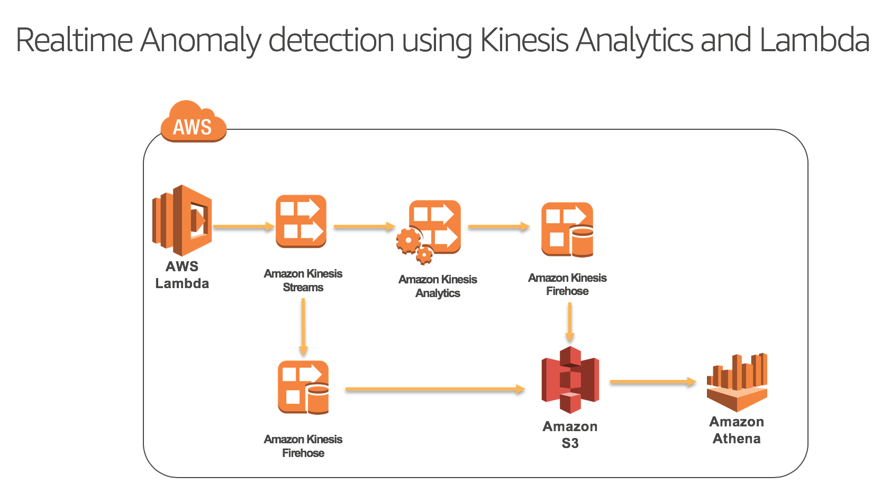

# Builders Session - 

Hands-on- 1
-----------------

Using AWS SAM template to create AWS Lambda function with Amazon Kinesis Stream trigger

Steps
-----------------

1. Log into your AWS account and create an AWS Cloud9 environment by going to Cloud9 dashboard
2. Open your IDE environment and in the terminal window, make a directory `` mkdir buildersession `` and cd into it
3. Git clone or manually create sam.yaml and index.js files from this repository
4. Create a new Amazon S3 bucket ``aws s3 mb s3://<YOUR_BUCKET_NAME> ``
5. Package AWS Lambda deployable zip by running the following command in the terminal window of you Cloud9 IDE - 

``sam package --template-file sam.yaml --s3-bucket <YOUR_BUCKET_NAME> --output-template-file packaged.yaml``

The above command will generate a new file named packaged.yaml in your working directory. This is the AWS Cloudformation script which will create AWS Lambda function in your environment in the next step.

6. Deploy AWS Lambda function by running the following comamnd - 

``sam deploy --template-file /home/ec2-user/environment/buildersession/packaged.yaml --stack-name reInventBuilderSessionStack --capabilities CAPABILITY_IAM``

7. Check the progress on the AWS Cloudformation by going to the AWS Cloudformation console in your AWS account.

8. Verify that the AWS Lambda function has been created by the AWS Cloudformation, with Amazon Kinesis Stream as trigger.

9. Create Amazon Kinesis Data Generator utility in your account by running the following AWS Cloudformation template - https://awslabs.github.io/amazon-kinesis-data-generator/web/help.html#template 

10. Log into the Amazon Kinesis data generator by going to the URL printed in the output section of the above AWS Cloudformation execution in step 8.

11. Select the AWS region and Amazon Kinesis Stream we just created from the drop down and start sending some data to the Amazon Kinesis Stream. Sample apache access logs event record - 

``{{internet.ip}} - - [{{date.now("DD/MMM/YYYY:HH:mm:ss ZZ")}}] "GET /index.html HTTP/1.1" 200 104 "-" "ELB-HealthChecker/1.0" ``

12. The AWS Lambda function simply polls the Amazon Kinesis Stream and prints it to the logs.

13. Verify the same by going to the Amazon CloudWatch logs console.

Conclusion
-----------------

We used AWS Serverless Application Model (SAM) to deploy the AWS Lambda function from the command line, with Amazon Kinesis Staream as an event source. We then used Amazon Kinesis Data Generator to pump some artificial data into our Amazon Kinesis Stream and saw it getting processed by the AWS Lambda function. AWS SAM is a great tool to define your serverless applications in simple and clean syntax. You can build your serverless application in the similar manner with many more event sources configured with your AWS Lambda function using AWS SAM.

More details on SAM can be found here- https://github.com/awslabs/serverless-application-model 

Hands-on- 2
-----------------

Using Amazon Kinesis Analytics to perform realtime Anomaly detection on streaming data.
Please download the instructions here - 

https://s3-us-west-2.amazonaws.com/vashi-test-bucket/reInvent-18-Analytics-Demo.docx

